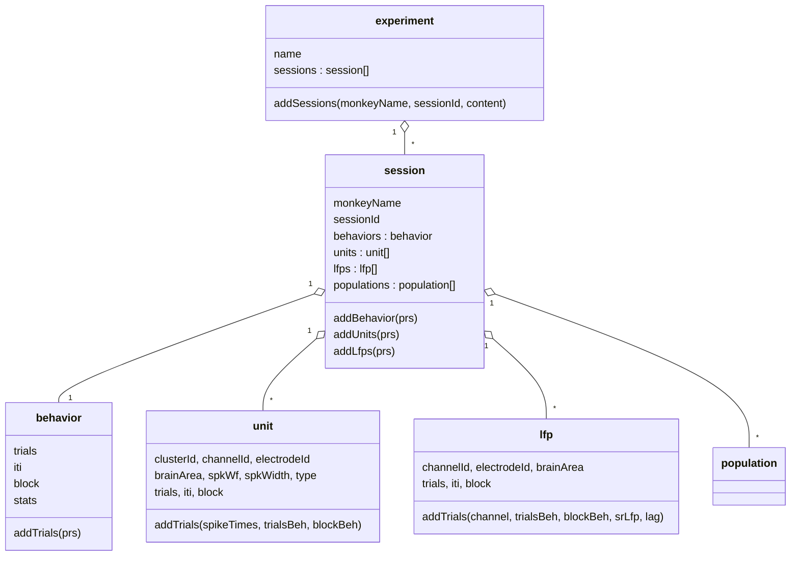

# foragingTaskFMM: data pipeline for the freely moving macaque (FMM) foraging task

MATLAB object model and import pipeline that turns one session of the FMM foraging experiment
(behaviour + motion capture + wireless neural recording) into an analysis-ready data structure.
It is the infrastructure under the behavioural analyses in
[foraging_policyIdentification](https://github.com/panosalef/foraging_policyIdentification) and the
2026 preprint *Temporal Structure of Reward Availability and Sensory Uncertainty Modulate Allocation
Dynamics in Naturalistic Foraging* ([doi:10.64898/2026.04.14.718537](https://doi.org/10.64898/2026.04.14.718537)).

**The experiment.** A macaque moves freely in a hexagonal arena with three push-button reward patches
on the walls. Each patch pays on its own variable-interval schedule and shows a cue whose reliability
(kappa) is controlled. Body and head are tracked by a Vicon motion-capture system, eye position by a
wireless eye tracker, and neural activity by Neuralynx wireless recording from multi-area probes. The
task software writes one `.beh` file per block with schedules, pushes and rewards.

## Architecture



One call does the whole import:

```matlab
addpath(genpath(pwd))
e = experiment('foraging');
e.addSessions('Marco', 20220106, {'behv','lfps','units'});   % see sessionLoader.m
```

`addSessions` resolves the session in the registry (`monkeyInfoFile.m`), builds the parameter struct
(`expParams.m`), imports behaviour (`importBehavior`), then, on request, LFPs and sorted units aligned
to the behaviour clock.

## What happens in the import

| Stage | Function(s) | What it does |
|---|---|---|
| Parameters | `expParams`, `fmmDataRoot`, `monkeyInfoFile` | Paths on the data share, task geometry, acquisition rates, LFP settings |
| Task files | `readBehFiles`, `getTrialPaths`, `findBehCorrupted` | Parse `.beh` blocks: schedules, kappa, pushes, rewards; drop corrupted files |
| Motion capture | `importBehavior` | Load Vicon blocks, verify animal/date/block, downsample to 50 Hz, interpolate and clean markers, compute centroid, head direction (earth and tilt frames), yaw/pitch/roll velocity, speed |
| Eyes | `importBehavior` | Apply eye calibration; eye-in-arena intersection (`getArenaInt`) |
| Arena geometry | `arena2d`, `arena3d`, `getArenaUnfolded`, `getHexEgoBoundary`, `getHexCevian`, `getPlaneFromPoints`, `plane_line_intersect` | Hexagonal arena model, egocentric distance to walls, unfolded 1-D and 2-D position (`getArena1dPosition`, `get2dOccup`) |
| Segmentation | `importBehavior` | Cut the block into push-to-push trials and inter-trial intervals; schedule-aligned position (`getScheduleAlignedPosition`), continuous push and reward-probability traces (`getContinuousPush`, `getContinuousRewProb`); per-block statistics |
| Clock alignment | `getViconNlxLag` | Cross-correlate the random sync pulse seen by Vicon and Neuralynx to get the per-block lag |
| Units | `getUnitsPhy`, `computeSpikeWidth`, `mapChannel2Electrode`, `getBrainArea`, `getElectrodeType`, `addTrials2Unit` | Read Kilosort/Phy output (`readNPY`), attach identity and quality metrics, cut spikes into trials |
| LFP | `readNlxChannel`, `addTrials2Lfp` | Read `.ncs` channels, Butterworth band-pass, downsample, align, cut into trials |
| Plotting | `monkeyGraph/` | Top-down head and tail glyphs for trajectory animations (`testMonkeyGraph.m` is a data-free demo) |

## Data model (behaviour)

- `block`: continuous 50 Hz series for the whole block: `t`, `position`, `transSpeed`,
  `headDirAziEarth`, `headDirAziTilt`, `tilt`, `yprVel`, `eyeH/eyeV/eyeD`, `eyeArenaInt`,
  `headArenaInt`, `hexEgoB*`, `circEgoB*`, `moveDirEarth`.
- `trials(i)`: `.events` (`tStart`, `tEnd`, `tPush`, `tReward`, `pushLogical`, sync pulses, dispenser),
  `.params` (`boxIdx`, `schedules`, `kappa`, `rewardRates`, `rewardRateFraction`), `.continuous` (the
  block variables cut to the trial, plus `positionScheduleAlign`, `rewardProb`, `tPush`).
- `iti(i)`: the continuous variables between trials.
- `stats`: `pushTotal`, `pushPerBox`, `pushFraction`, `rewardTotal`, `rewardPerBox`, `rewardFraction`,
  `distance`, `meanVelocity`, `goodTrialIdx`, `trialNumber`.

## Layout

```
@experiment/ @session/ @behavior/ @unit/ @lfp/ @population/   class definitions and methods
expParams.m            per-session parameters          fmmDataRoot.m   data-share root (env override)
monkeyInfoFile.m       session registry                sessionLoader.m example entry point
functionsBehavior/     task files, motion capture, eye, arena geometry, segmentation
functionsUnit/         Phy import, spike width, channel maps, clock alignment
functionsLFP/          Neuralynx channel import, trial cutting
monkeyGraph/           plotting helpers
utilities/             small helpers (obj2struct, nancorr, ...) and third-party tools
npy-matlab-master/     third-party: readNPY/writeNPY (test data removed)
```

## Requirements

MATLAB R2020a or later with the Signal Processing Toolbox (`butter`, `filtfilt`, `xcorr`). Neuralynx
file import uses the bundled Neuralynx MATLAB tools (Windows MEX binaries). Kilosort/Phy output is read
with the bundled `npy-matlab`. Data (`.beh`, Vicon `.mat`, `.ncs/.nev`, sorted spikes) live on the lab
share and are not part of the repository; point `FMM_DATA_ROOT` at a local copy if needed.

## Third-party code

`npy-matlab` (Kwik Team, MIT), Neuralynx MATLAB Import/Export (Neuralynx), `shadedErrorBar` (Rob
Campbell), `vline` (Brandon Kuczenski), `makeDat_v06` (dat-file conversion for spike sorting). Each
keeps its own licence; see the file headers.

## Licence

MIT (see `LICENSE`) for the code in this repository; third-party components as above.
